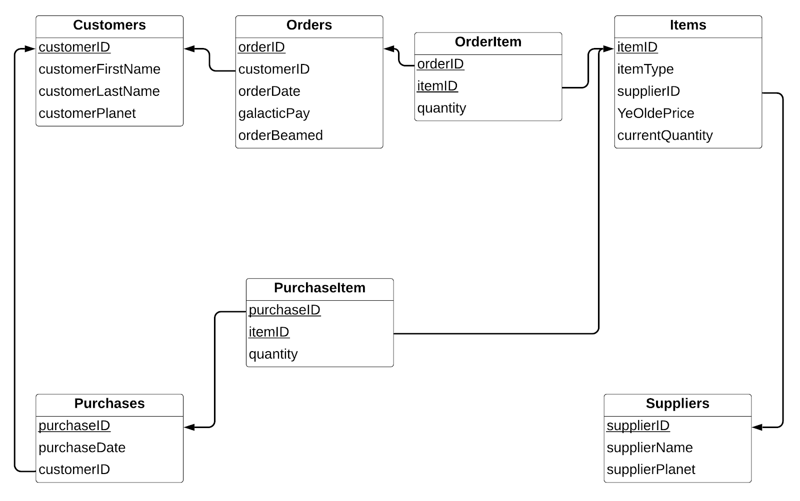
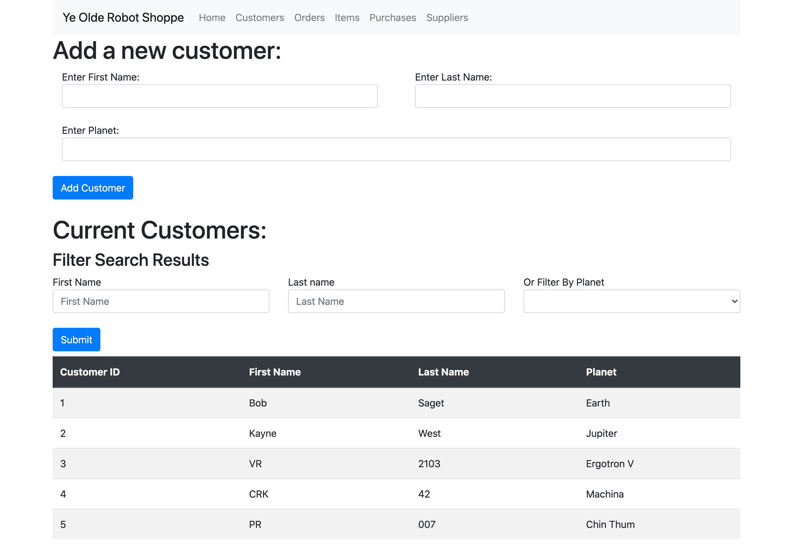
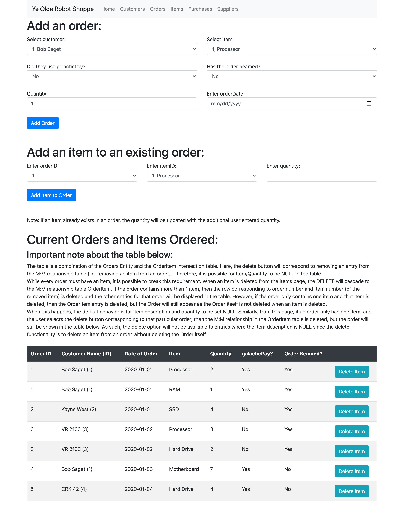
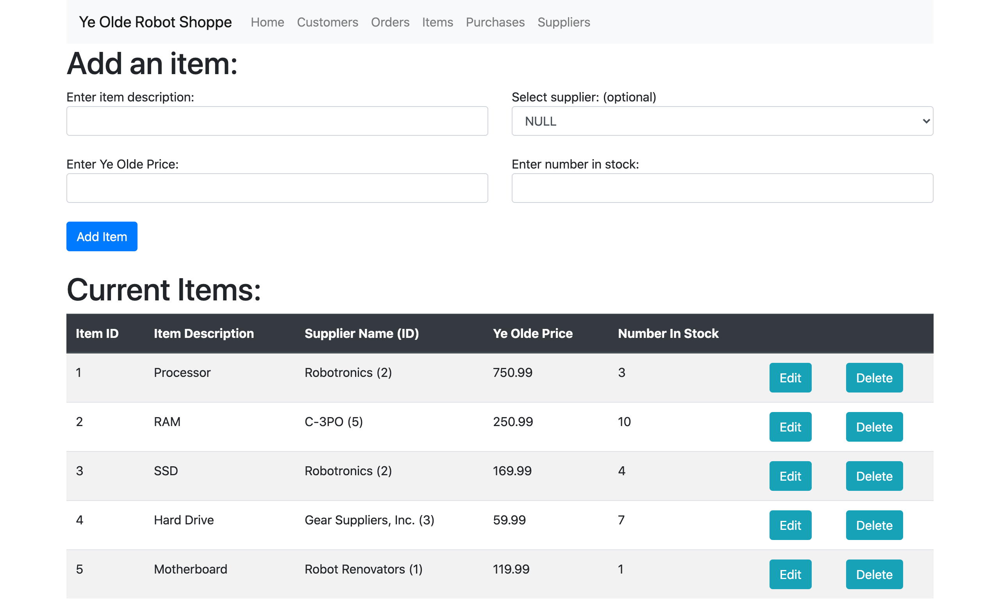
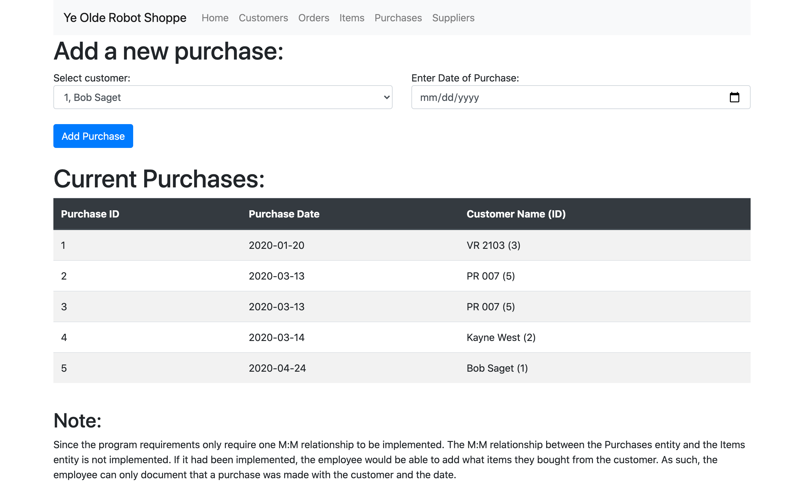
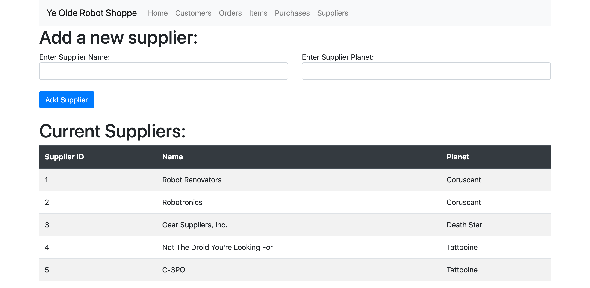

# YORS
Ye Olde Robot Shoppe simulates a robot parts store with a SQL database consisting of several different tables and types of relationships.

The database was designed using an entity-relationship diagram as well as a schema.

As can be seen in the above diagrams, several different types of tables and relationships are present. 

1:Many Relationships:
Customers:Orders
Customers:Purchases
Suppliers:Items

Many:Many Relationships:
Items:Purchases
Orders:Items

In the final version of the project, the Items:Purchases M:M relationship was not implemented. However, the Orders:Items relationship was implemented with an OrdemItem table. The OrderItem table can be viewed on the "Items" page in table.

The project was built with Node.js, Express, MySQL, Handlebars, and Bootstrap. While the page is no longer being hosted, below are screenshots of how the project was implemented:

Home Page:

Customers Page:

Orders Page:

Items Page:

Purchases Page:

Suppliers Page:

